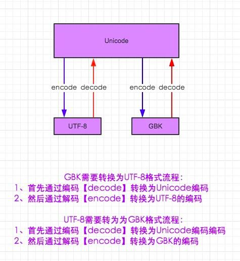
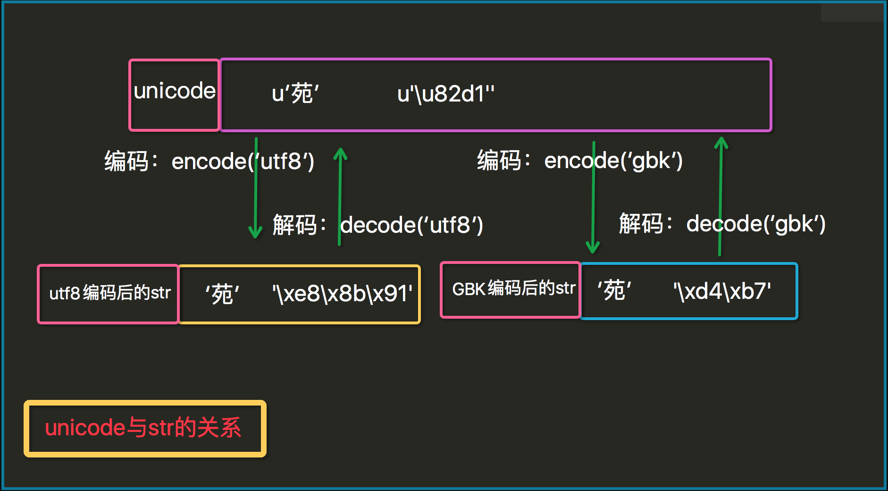
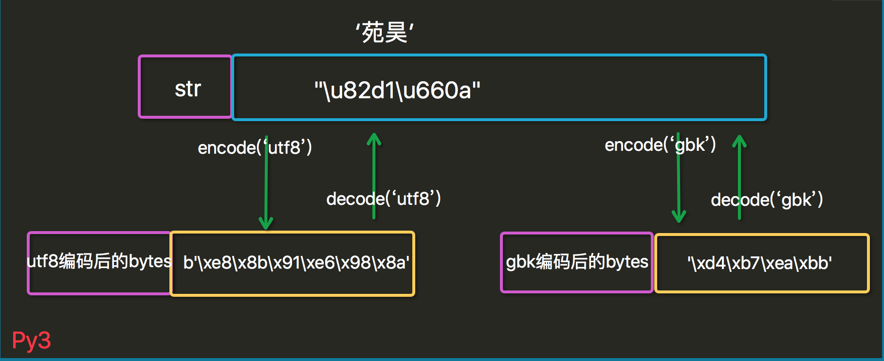
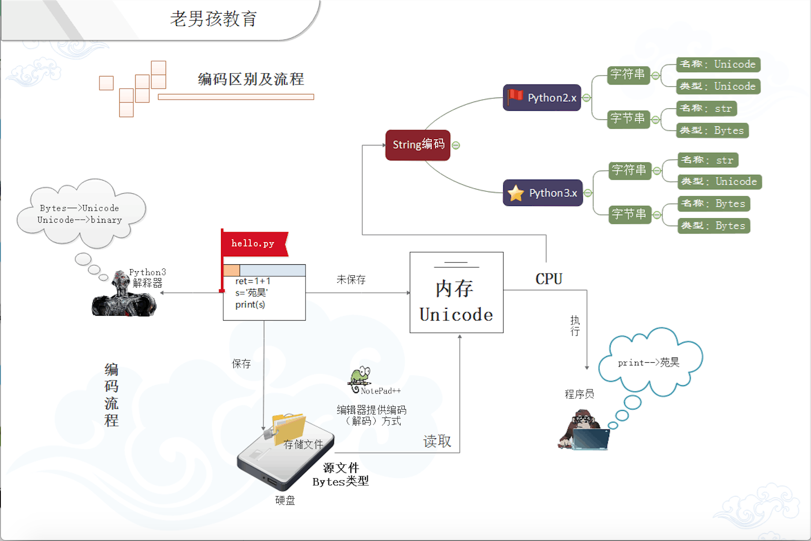

# 字符编码与转码
字符编码：
- ASCII: 一个字节，最多能表示255个字符
- GB2312（1980年）：一共收录了7445个字符，包括6763个汉字和682个其它符号。
- GBK1.0(1995年)：收录了21886个符号，它分为汉字区和图形符号区。汉字区包括21003个字符。
- GB18030(2000年)：取代GBK1.0的正式国家标准，该标准收录了27484个汉字
- Unicode(统一码，万国码)：
    
    为了解决传统的字符编码方案的局限而产生的，它为每种语言中的每个字符设定了统一并且唯一的二进制编码，规定虽有的字符和符号最少由 16 位来表示（2个字节），即：2 **16 = 65536
- utf-8 : 

    是对Unicode编码的压缩和优化，他不再使用最少使用2个字节，而是将所有的字符和符号进行分类：ascii码中的内容用1个字节保存、欧洲的字符用2个字节保存，东亚的字符用3个字节保存...

## python2





## python3
在python3中，默认是Unicode,
py3也有两种数据类型：str和bytes；  str类型存unicode数据，bytse类型存bytes数据，与py2比只是换了一下名字而已。




- py3的编码哲学：

Python 3最重要的新特性大概要算是对文本和二进制数据作了更为清晰的区分，不再会对bytes字节串进行自动解码。文本总是Unicode，由str类型表示，二进制数据则由bytes类型表示。Python 3不会以任意隐式的方式混用str和bytes，正是这使得两者的区分特别清晰。你不能拼接字符串和字节包，也无法在字节包里搜索字符串（反之亦然），也不能将字符串传入参数为字节包的函数（反之亦然）。

- 注意：无论py2，还是py3,与明文直接对应的就是unicode数据，打印unicode数据就会显示相应的明文(包括英文和中文)

```python
# 获取python环境编码
import sys
print(sys.getdefaultencoding())
```



http://www.cnblogs.com/yuanchenqi/articles/5956943.html